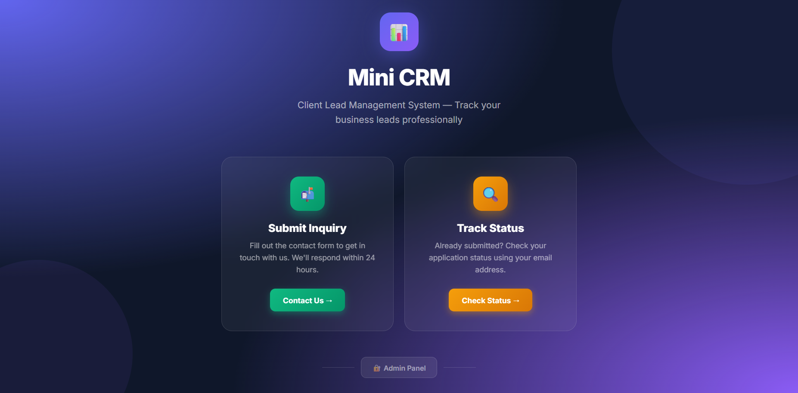
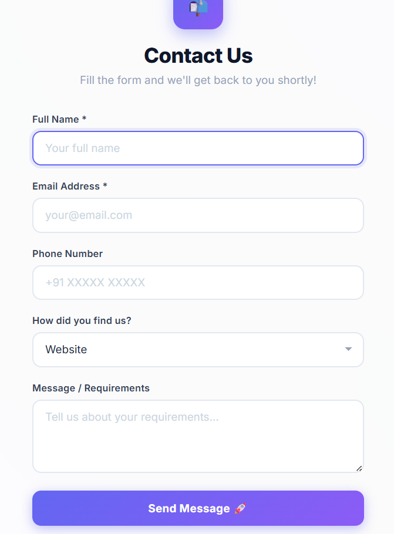
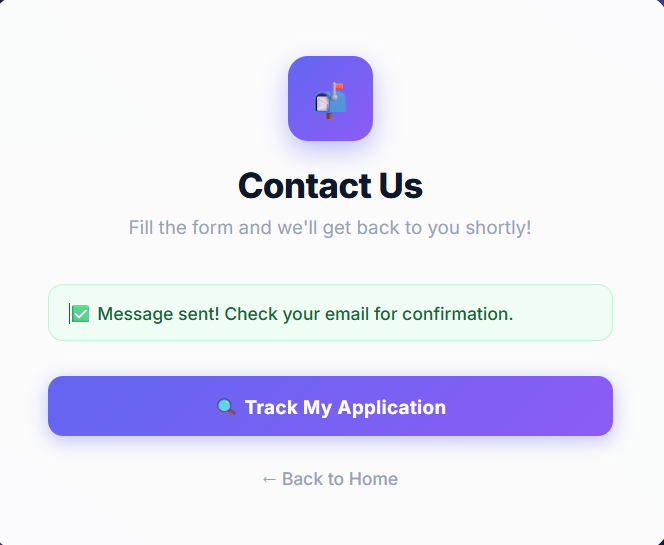
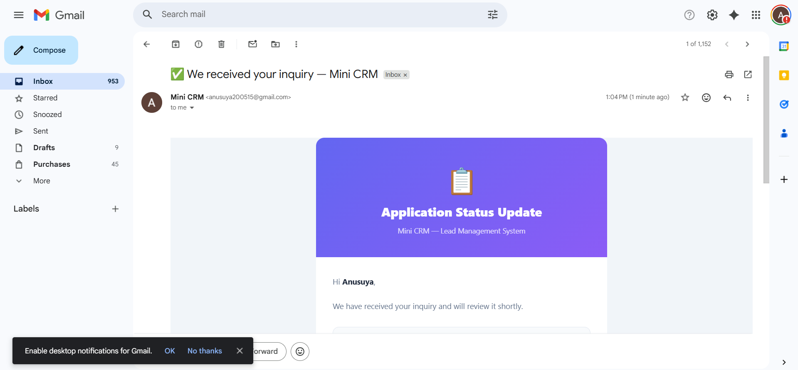
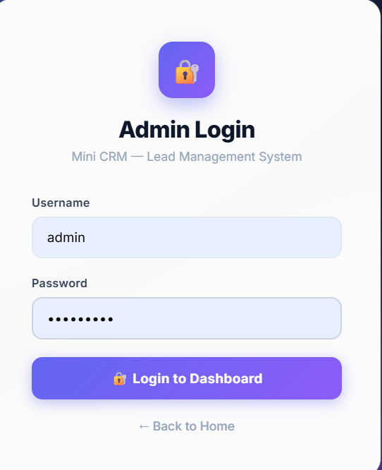
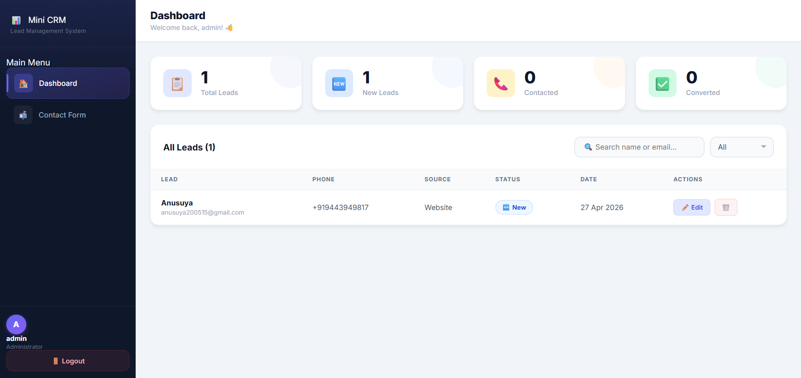
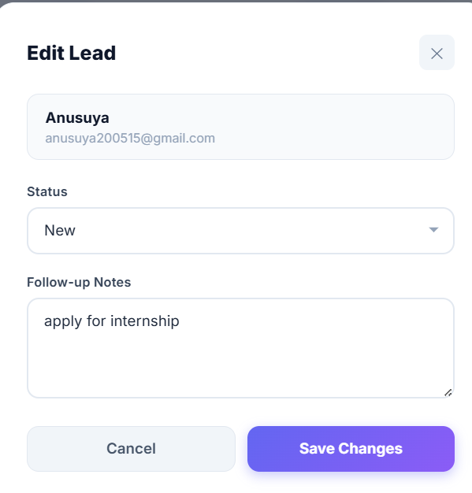
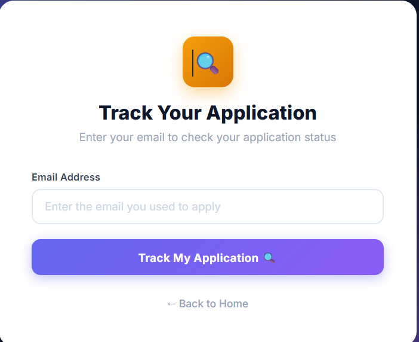
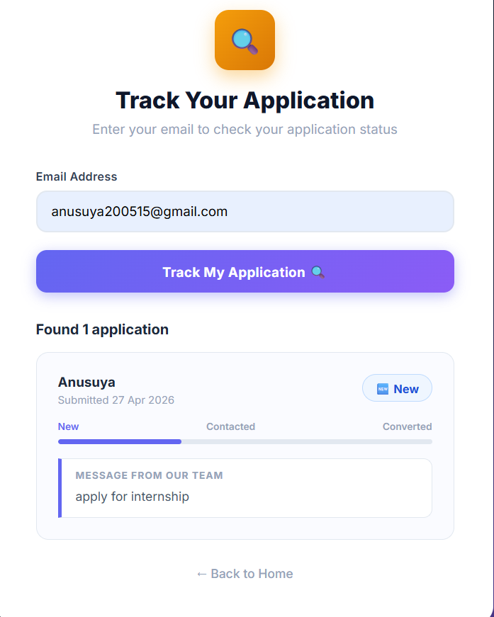

# 📊 Mini CRM — Client Lead Management System

> Built for **Future Interns | Full Stack Web Development | Task 2**

A production-ready Client Lead Management System built with the MERN stack. Businesses use this to collect leads from a contact form, manage them through a secure admin dashboard, and automatically notify customers via email when their status changes.

---

## 🌐 Live Demo

| | Link |
|---|---|
| 🖥️ Live Website | https://future-fs-02-5ey2cmf75-anusuya2005s-projects.vercel.app |
| ⚙️ Backend API | https://future-fs-02-backend-tcf7.onrender.com |
| 📂 GitHub Repo | https://github.com/anusuya2005/FUTURE_FS_02 |

---

## ⚠️ Important Note for Evaluators

This project backend is hosted on Render free tier which sleeps after inactivity.

**Please follow these steps before testing:**

**Step 1 — Wake up the backend first by opening this link:**

https://future-fs-02-backend-tcf7.onrender.com

Wait until you see this message:

    Mini CRM Backend is Running! 🚀

**Step 2 — Then open the main website:**

https://future-fs-02-5ey2cmf75-anusuya2005s-projects.vercel.app

Everything will work instantly after the backend is awake.

The backend has a keep-alive system that pings itself every 14 minutes to stay awake during active use.

---

## 🔐 Evaluator Access

**Open the main website and click Admin Panel button on the landing page.**

| Field | Value |
|-------|-------|
| Username | admin |
| Password | Admin1234 |

---

## 📋 Step by Step Evaluation Guide

**Step 1 — Open Landing Page**

Open https://future-fs-02-5ey2cmf75-anusuya2005s-projects.vercel.app

You will see three options — Submit Inquiry, Track Status, and Admin Panel.

**Step 2 — Submit a Test Lead**

Click Contact Us and fill the form with any details using your real email address. Click Send Message. You will receive a confirmation email automatically.

**Step 3 — Login as Admin**

Click Admin Panel on the landing page and login with:

    Username: admin
    Password: Admin1234

**Step 4 — Manage the Lead**

In the dashboard you will see the lead submitted in Step 2. Click Edit, change status to Contacted, add a follow-up note, and click Save. The customer receives an email automatically.

**Step 5 — Track Status as Customer**

Click Track Status on the landing page. Enter the email used in Step 2. See the live status with progress bar and admin notes.

**Step 6 — Convert the Lead**

Login as admin again, edit the lead, change status to Converted. Customer receives a congratulations email.

---

## 📌 All Pages

Navigate from the main website — do not open page URLs directly.

| Page | How to Access |
|------|--------------|
| 🏠 Landing Page | Open main website link |
| 📬 Contact Form | Click Contact Us on landing page |
| 🔍 Track Status | Click Track Status on landing page |
| 🔐 Admin Login | Click Admin Panel on landing page |
| 📊 Dashboard | Login as admin first |

---
## 📸 Screenshots

Here is a quick visual walkthrough of the application:

### 🏠 Landing Page

  

### 📬 Contact Form

  

### ✅ Submission Success

  

### 📧 Email Notification

  

### 🔐 Admin Login

  

### 📊 Admin Dashboard

  

### ✏️ Edit Lead

  

### 🔍 Track Page

  

### 📈 Track Status Result

  

## 💡 What Is This Project?

A CRM (Client Relationship Management) system is used by businesses to manage incoming client inquiries called leads.

Real world example — A restaurant wants to list on Swiggy. They fill a registration form. Swiggy's admin team sees the request in their dashboard, reviews it, contacts the restaurant, and once approved marks it as Converted. The restaurant gets email updates at every step. This project works exactly the same way.

---

## 🔄 How It Works

1. Customer fills the Contact Form
2. Lead is saved to MongoDB database
3. Customer receives a confirmation email
4. Admin logs into the Dashboard
5. Admin reviews the lead and updates the status
6. Customer receives an email notification automatically
7. Customer can track their status from the Track Status page

---

## ✨ Features

### Customer Side
- Submit inquiry via contact form
- Receive confirmation email instantly
- Track application status using email address
- See progress bar showing New, Contacted, Converted
- Read follow-up notes left by admin

### Admin Side
- Secure login with JWT authentication
- Registration locked after first admin is created
- View all leads in a professional dashboard table
- Analytics cards showing Total, New, Contacted, Converted counts
- Update lead status with one click
- Add follow-up notes visible to the customer
- Search leads by name or email
- Filter leads by status
- Auto email sent to customer on every status change
- Delete spam or invalid leads
- Fully mobile responsive on all devices

---

## 🛠️ Tech Stack

| Layer | Technology | Purpose |
|-------|-----------|---------|
| Frontend | React.js + Vite | User interface |
| Styling | CSS3 + Google Fonts | Responsive design |
| Backend | Node.js + Express.js | REST API server |
| Database | MongoDB + Mongoose | Data storage |
| Authentication | JWT + bcryptjs | Secure admin login |
| Email | Nodemailer + Gmail | Status notifications |
| HTTP Client | Axios | API communication |
| Routing | React Router DOM | Page navigation |
| Frontend Hosting | Vercel | Live deployment |
| Backend Hosting | Render | Live deployment |
| Cloud Database | MongoDB Atlas | Cloud database |

---

## 📁 Project Structure

    FUTURE_FS_02/
    │
    ├── backend/
    │   ├── middleware/
    │   │   └── authMiddleware.js
    │   ├── models/
    │   │   ├── Admin.js
    │   │   └── Lead.js
    │   ├── routes/
    │   │   ├── authRoutes.js
    │   │   └── leadRoutes.js
    │   ├── utils/
    │   │   └── sendEmail.js
    │   ├── .env
    │   └── server.js
    │
    ├── frontend/
    │   └── src/
    │       ├── components/
    │       │   ├── Navbar.jsx
    │       │   └── Sidebar.jsx
    │       ├── context/
    │       │   └── AuthContext.jsx
    │       ├── pages/
    │       │   ├── Landing.jsx
    │       │   ├── ContactForm.jsx
    │       │   ├── TrackStatus.jsx
    │       │   ├── Login.jsx
    │       │   ├── Register.jsx
    │       │   └── Dashboard.jsx
    │       ├── config.js
    │       ├── App.jsx
    │       ├── index.css
    │       └── main.jsx
    │
    └── README.md

---

## ⚙️ Local Setup Instructions

### Prerequisites
- Node.js v18 or higher
- MongoDB installed locally
- Git

### Step 1 — Clone the Repository

    git clone https://github.com/anusuya2005/FUTURE_FS_02.git
    cd FUTURE_FS_02

### Step 2 — Setup Backend

    cd backend
    npm install

Create a .env file inside the backend folder:

    PORT=5000
    MONGO_URI=mongodb://localhost:27017/minicrm
    JWT_SECRET=mysecretkey123
    ADMIN_SECRET_KEY=SWIGGY_ADMIN_2026
    EMAIL_USER=yourgmail@gmail.com
    EMAIL_PASS=your_gmail_app_password

To get EMAIL_PASS go to Google Account, then Security, then 2-Step Verification, then App Passwords, then Generate.

Start the backend:

    npm run dev

You should see:

    MongoDB Connected
    Server running on port 5000

### Step 3 — Setup Frontend

    cd ../frontend
    npm install
    npm run dev

Open http://localhost:5173 in your browser.

### Step 4 — Create Admin Account

Go to http://localhost:5173/register and enter:

    Username: admin
    Password: Admin1234

After the first admin is created, registration is locked and new admins require the ADMIN_SECRET_KEY.

---

## 🔐 Security Features

| Feature | How It Works |
|---------|-------------|
| JWT Authentication | Admin receives a token on login required for all protected API calls |
| Password Encryption | Passwords hashed with bcryptjs before storing in database |
| Protected Routes | Dashboard redirects to login if no valid token is found |
| Locked Registration | After first admin, new accounts require a secret organisation key |
| CORS Protection | Backend only accepts requests from authorised frontend URLs |

---

## 📱 Responsive Design

| Device | Layout |
|--------|--------|
| Desktop and Laptop | Full sidebar with 4 column stats grid |
| Tablet | Collapsible sidebar with 2 column stats grid |
| Mobile and Android | Slide-in drawer with fully stacked layout |

---

## 📧 Email Notification System

Customers receive automatic emails when:

- They submit the contact form and receive a confirmation
- Admin changes status to Contacted
- Admin changes status to Converted and customer receives a congratulations email

Each email includes the current status, admin notes, and a button to open the main website and track their application.

---

## 🌍 Real World Applications

| Business | Use Case |
|----------|---------|
| Digital Agency | Track client inquiries from website |
| Restaurant Platform | Manage restaurant onboarding requests |
| Freelancer | Manage project inquiries from clients |
| Clinic | Track patient appointment requests |
| Startup | Manage early customer signups |

---

## ⚠️ Challenges Faced

### 1. MongoDB Atlas Network Block
During development, MongoDB Atlas connection was blocked by the local network firewall. The error was querySrv ECONNREFUSED which means the network was not allowing SRV DNS lookups required by Atlas. This was solved by using a local MongoDB installation for development and MongoDB Atlas only for the deployed version on Render where there are no firewall restrictions.

### 2. CORS Errors on Deployment
When the frontend was deployed on Vercel and the backend on Render, the browser was blocking API requests due to CORS policy. Every time Vercel created a new deployment it generated a different URL which was not allowed in the backend CORS configuration. This was solved by updating the CORS configuration to allow all Vercel subdomains dynamically instead of hardcoding specific URLs.

### 3. Direct URL Access Returns 404
When users open page URLs directly in the browser such as /login or /track, Vercel returns a 404 error because it cannot find those folders. This happens because React Router handles routing inside the browser but Vercel serves static files and does not know about React routes. The current workaround is to always navigate from the main landing page. This is a known limitation of deploying React SPA applications on static hosting platforms.

### 4. Render Free Tier Sleep
The backend hosted on Render free tier goes to sleep after 15 minutes of inactivity. When a user visits the website after the backend has slept, the first request takes 50 to 60 seconds to respond. This was partially solved by adding a keep-alive ping system that sends a request to the backend every 14 minutes to prevent it from sleeping during active use.

### 5. bcryptjs Pre-save Hook Error
During development the Mongoose pre-save hook for password hashing was throwing a next is not a function error. This was caused by a conflict between the dotenvx package and the bcryptjs library. The solution was to remove dotenvx and move the password hashing logic from the model pre-save hook directly into the route handler where it works reliably.

### 6. Email Track Link 404
The email notification sent to customers included a direct link to the track status page. When customers clicked this link it opened the direct URL which returned a 404 error due to the Vercel routing issue mentioned above. This was solved by changing the email button to open the main landing page instead, from where users can navigate to the track status page without any 404 errors.

### 7. Email Delivery Issue on Render Free Tier

After deployment the email notification system 
stopped working even though it worked perfectly 
during local development. The error was 
Connection timeout when trying to connect to 
Gmail SMTP server.

The reason is Render free tier randomly blocks 
outgoing SMTP ports (465 and 587) which are 
required to send emails. This is a known 
limitation of free hosting platforms.

The email system works correctly in local 
development environment where there are no 
port restrictions. The code and configuration 
are correct — the issue is purely a hosting 
platform limitation.

Possible fixes for production use:
- Upgrade to Render paid plan which removes 
  port restrictions
- Use a transactional email service like 
  Brevo, SendGrid, or Mailgun which use 
  HTTP API instead of SMTP ports
- Use AWS SES which works reliably on all 
  hosting platforms

---

## 🚀 Future Improvements

### 1. Fix Direct URL Access
The biggest improvement needed is to properly configure Vercel to handle React Router URLs. This can be done by upgrading to a paid Vercel plan which supports server-side rendering with Next.js, or by migrating the frontend to Next.js which handles routing on the server side and eliminates the 404 issue completely.

### 2. Always-On Backend
Upgrading from Render free tier to a paid plan at 7 dollars per month would keep the backend running 24 hours a day without any sleep delay. Alternatively the backend could be migrated to Railway or Fly.io which offer better free tier options with no sleep restriction.

### 3. Export Leads to CSV
Add a button in the dashboard to download all leads as a CSV or Excel file. This would allow business owners to import leads into other tools like Google Sheets or Excel for further analysis and reporting.

### 4. Lead Priority System
Add a priority field to each lead such as Hot, Warm, or Cold so the admin can quickly identify which leads need immediate attention and which can be followed up later.

### 5. Follow-up Reminder System
Add a follow-up date field to each lead. The system would automatically send a reminder email to the admin when a follow-up date is approaching so no lead is forgotten.

### 6. Dashboard Analytics Charts
Add visual charts using a library like Recharts to show lead trends over time, conversion rates, and source breakdown. This would give business owners better insights into where their leads are coming from and how many are converting.

### 7. Multiple Admin Roles
Add role-based access control with a Super Admin who can create and manage other admin accounts, and regular admins who can only manage leads. This would be useful for larger teams.

### 8. WhatsApp Notification
Integrate Twilio API to send WhatsApp messages to the admin whenever a new lead is submitted. This would ensure the admin is notified instantly on their phone without needing to check email.

### 9. Lead Notes History
Currently notes are overwritten each time. A better approach would be to store a full history of all notes and status changes with timestamps so the admin can see the complete timeline of each lead.

### 10. Custom Domain
Connect a custom domain name to the Vercel deployment so the website has a professional URL instead of the auto-generated Vercel URL. This would also fix the direct URL access issue since a custom domain with proper DNS configuration supports React Router paths.

### 11. Reliable Email Service

Replace Nodemailer Gmail SMTP with a proper 
transactional email service like Brevo or 
SendGrid. These services use HTTP API instead 
of SMTP ports so they work on all hosting 
platforms including Render free tier. They 
also provide email delivery tracking, open 
rates, and bounce handling which is useful 
for a real CRM system.

---

## 👨‍💻 Developer

**Anusuya**

Future Interns — Full Stack Web Development Internship 2026

- GitHub: https://github.com/anusuya2005
- LinkedIn: https://www.linkedin.com/in/anusuya-v-5b548a303/

---

*Treat each task as if it were for a real client — Future Interns*